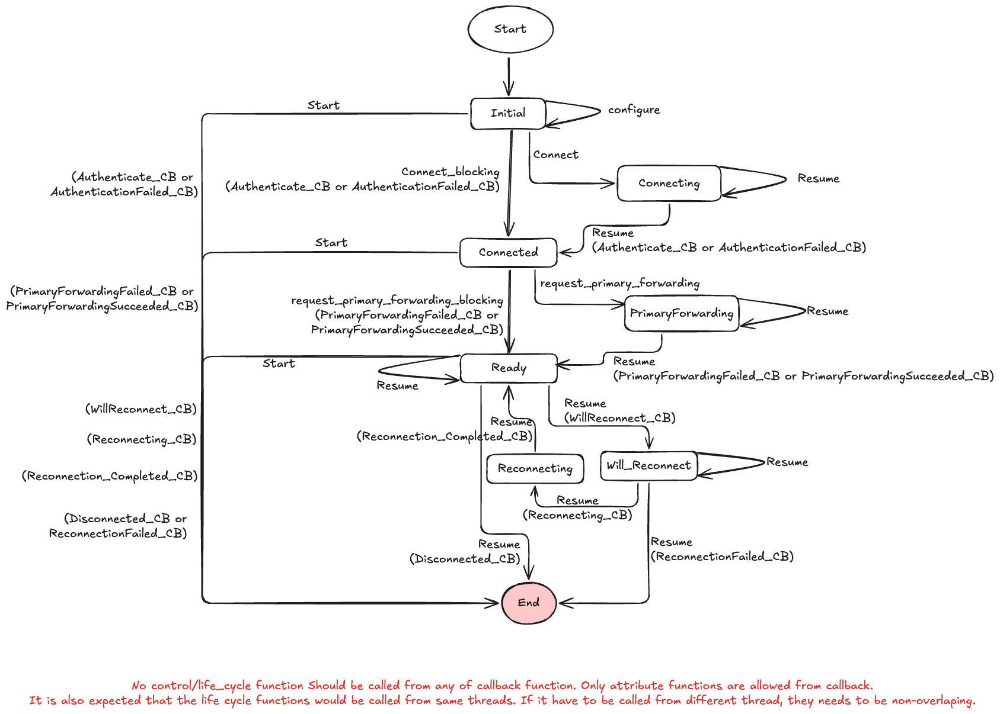

# libpinggy - core sdk for Pinggy
A C++ library intended for creating bindings to all major languages.

## Building instructions for windows

Install the dependencies.

### Dependencies

1. `git` - Download and install git
2. Visual Studio - use the script (run as administrator) - `crossbuilding/windows/utilities/install_visual_studio.bat`
3. Pearl - use the script (run as administrator) - `crossbuilding/windows/utilities/install_pearl.bat`
4. NASM - use the script (run as administrator) - `crossbuilding/windows/utilities/install_nasm.bat`

### OpenSSL

Building libpinggy requires OpenSSL to be built first.

**Todo:** Add a script to download prebuild opesnssl files.

Place the openssl built files in `C:\OpenSSL\`

**Building from sorce:**

Run the script `crossbuilding/windows/opensslbuild.bat`

## Building  libpinggy from source


`.\crossbuilding\windows\buildForWindows.bat C:\OpenSSL\ releases build`

`.\crossbuilding\windows\buildForSingleArch.bat x86_64 MT`


# Manual building
Once OpenSSL is installed, manual build can be done using following commands
```bash
mkdir build
cmake ..
cmake --build . -j --config Release //building the code
cmake --build . releaselib //releasing libpinggy and
cmake --build . releasessl //releasing ssl
cmake --build . distribute //creating libpinggy.tgz/zip
```

Also, one can use our build system. It will take care of openssl library as well. However, this is different for every os.

**MacOs**
```bash
LOG_LEVEL=LogLevelDebug RELEASE_CLI=yes RELEASE_SO=yes RELEASE_SSL=yes PINGGY_DEBUG=yes bash crossbuilding/macos/buildForMacos.sh
```

# Tunnel life cycle



